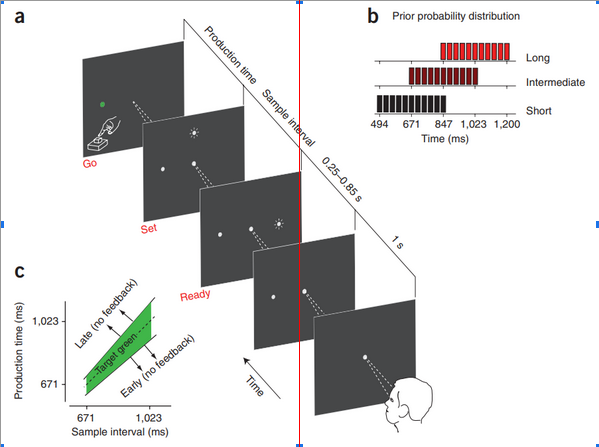

This github repository reproduces the **"Central-tendency”** effect in temporal reproduction using Bayesian formula describe in the papers by **Zhuanghua Shi** et al and **Jazayeri** et al.

**Bayesian inference for predicting central-tendency**

_Jazayeri et al._ published an interesting paper  (Temporal context calibrates interval timing) on it. Where they have choosen partially overlapped intervals.

