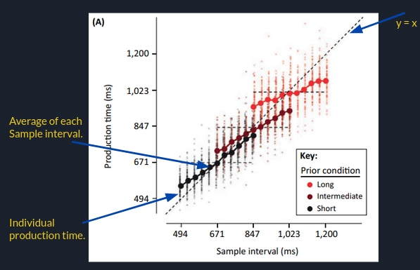

This github repository reproduces the **"Central-tendency”** effect in temporal reproduction using Bayesian formula describe in the papers by **Zhuanghua Shi** et al and **Jazayeri** et al.

**Bayesian inference for predicting central-tendency**

_Jazayeri et al._ published an interesting paper  (Temporal context calibrates interval timing) on it. Where they have chosen partially overlapped intervals.

Hence this repo;
1) Make an implementation of the Bayesian model of time perception presented in those papers.
2) Reproduce **"Central-tendency”** effect that was presented in the paper using fake/artificially generated data.

The paper shows how to use Bayesian formula to describe “Central-tendency” effect in temporal reproduction.

The figure illustrate the followings; 
* Production times monotonically increases with sample interval.
* Average production time deviated from the line y = x and towards the mean of the prior (systematic bias). 
* For “long”, deviation is high.. Strong bias.

